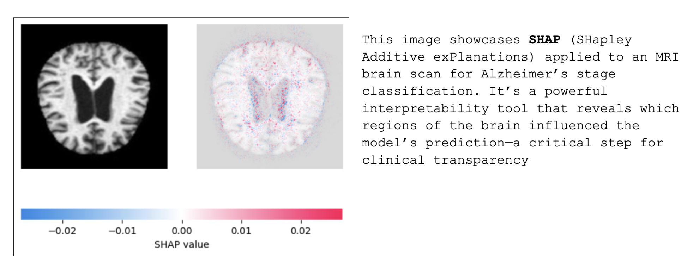
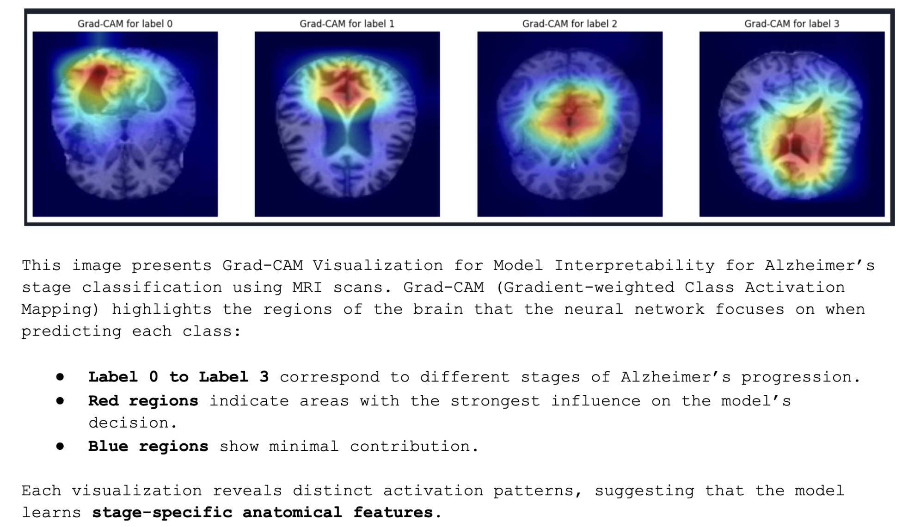
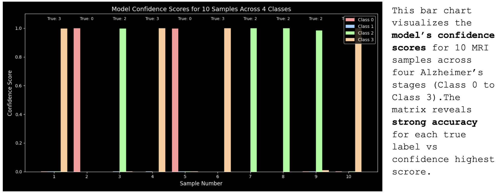
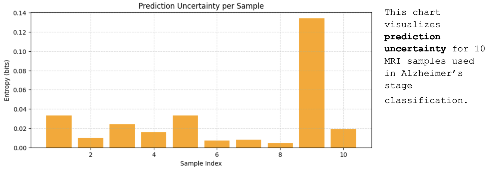
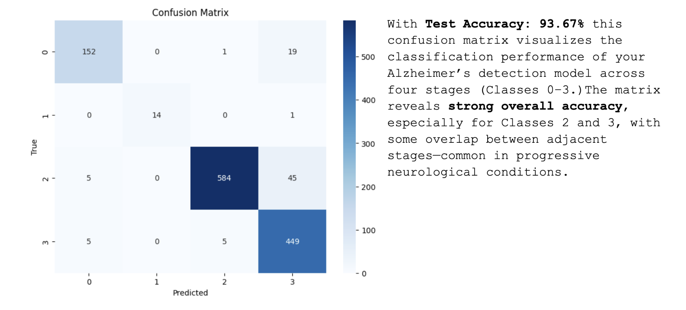

# 🧠 AI-Driven Alzheimer’s Stage Classification Using MRI and Deep Learning

## 🔍 Abstruct

Alzheimer’s disease affects millions globally, yet early-stage diagnosis remains challenging due to subtle anatomical changes and limited access to expert radiologists. This project builds a transparent, interpretable AI system that classifies Alzheimer’s stages (0–3) from MRI brain scans—empowering clinicians with reliable decision support and advancing ethical medical AI.

**Key Goals:**
- Early detection to improve patient outcomes  
- Model interpretability to build clinical trust  
- Fairness and transparency across demographic subgroups  
- Open-source reproducibility for global accessibility  

---

## 📦 Data Sources

The model is trained on publicly available **Kaggle Alzheimer’s MRI datasets**, structured into DataFrames with stage labels and metadata. All scans are anonymized and preprocessed for consistency.

---

## 🧪 Methods/Architechture

### 🗂️ Data Processing
- **Loading & Preprocessing**: MRI images ingested from structured DataFrames  
- **Custom PyTorch Dataset**: Handles image-label pairing and metadata parsing  
- **Image Transformation**: Resizing, normalization, and optional Mixup augmentation  

### 🧠 Model Processing
- **Architecture**: EfficientNet backbone with dynamic flattening  
- **Class Imbalance Handling**: Weighted loss functions and stratified sampling  
- **Training Strategy**: Mixup augmentation, early stopping, and adaptive learning rate scheduling  

---

## 📈 Evaluation

### ✅ Validation Phase
- Early stopping logic  
- Batch-level performance tracking  
- Accuracy comparison across architectures  

### 📊 Performance Metrics
- **Test Accuracy**: 93.67%  
- **Loss Curves**: Stable convergence over 20 epochs  
- **Confusion Matrix**: High precision for Classes 2 and 3  
- **Entropy Plot**: Highlights uncertain predictions for human review  

---

## 🔍 Interpretability Tools

### 🔹 SHAP (SHapley Additive Explanations)
- Voxel-level feature attribution  
- Reveals regions influencing model predictions  


### 🔹 Grad-CAM Overlays
- Highlights spatial attention per class  
- Distinct activation patterns across stages  


### 🔹 Confidence Scores
- Per-sample prediction certainty across 4 classes  


### 🔹 Prediction Uncertainty
- Entropy-based visualization for 10 samples  


### 🔹 Confusion Matrix
- True vs predicted label distribution  


---

## 🌍 Impact

This project blends technical rigor with ethical design, offering a reproducible, interpretable tool for Alzheimer’s detection.

---

## 🚀 How to Run

```bash
# Clone the repo
git clone https://github.com/reetamit/Alzheimers_Detection_ML.git

# Install dependencies
pip install -r requirements.txt

# Make your MRI image train and test file as parquet format
# update drive_path = "[Set your project data path location where you stored both parquet file]"
jupyter nbconvert --execute --inplace --to notebook AI_Alzheimer_Detection.ipynb
#Model will same as file name AI_Alzmrmdl_enetb0.pth at your project data path